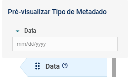
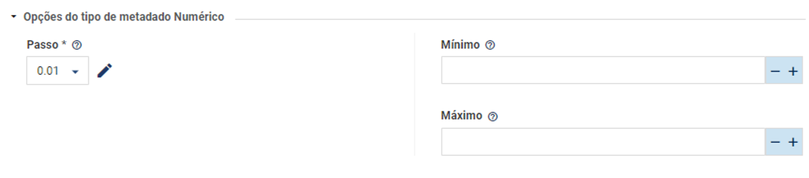

# 🗺️ Mapeando o Tainacan

# **Diretórios**

## ***assets***

Arquivso estáticos usados pelo plugin:  estilos CSS, scripts JS, imagens e fontes customizadas

## ***classes***

Principal pasta do plugin, define as classes seguindo um paradigma OO utilizadas nas funcionalidades do sistema:

### ***api***

Diretório responsável pelas classes utilizadas na API Rest do plugin.

1. **class-tainacan-rest-controller.php**
    1. Arquivo responsável pela definição da classe abstrata ***REST_Controller*** que extende o Rest Controller padrão do Wordpress ***WP_REST_Controller.***
    2. No construtor da classe, é executado o hook do rest_api_init para que após a inicialização da API Rest, as rotas sejam registradas através do método register_routes
2. ***endpoints/***
    1. Arquivos controllers responsáveis por criar os métodos responsáveis por cada rota e os registrá-los
3. **tainacan-rest-creator.php**
    1. Arquivo responsável por definir o namespace da API Rest
    2. Arquivo responsável por instanciar os controllers dos endpoints a serem utilizados

### ***entities***

- class-tainacan-collection.php
    - Define a classe collection
- class-tainacan-entity.php
- class-tainacan-filter.php
- class-tainacan-item-metadata-entity.php
- class-tainacan-item.php
- class-tainacan-log.php
- class-tainacan-metadata-section.php
- class-tainacan-metadatum.php
- class-tainacan-taxonomy.php
- class-tainacan-term.php

### ***repositories***

Os repositórios são responsáveis por implementar a camada de gerenciamento de dados do Tainacan. Lógica para realizar o mapeamento das entidades para os post-types e metadado do Wordpress
→ **Principais funções**: `insert`, `update`, `delete`, `fetch`

1. **Repository** → class-tainacan-repository.php
    - Arquivo responsável pela definição da classe abstrata **Repository.** Ela contém propriedades e métodos que são comuns a todos os repositórios da aplicação.
2. **Collections** → class-tainacan-collections.php
3.  **Metadata** → class-tainacan-metadata.php
4. **MetadataSections** →class-tainacan-metadata-sections.php
5.  **Filters** → class-tainacan-filters.php
6. **Items** → class-tainacan-items.php
7.  **ItemMetadata** → class-tainacan-item-metadata.php
8. **Taxonomies** → class-tainacan-taxonomies.php
9. **Terms** → class-tainacan-terms.php
10. **Logs** → class-tainacan-logs.php

## ***views***

Diretório que contém os arquivos relacionados a interface de usuário do plugin.

1. **class-tainacan-admin.php**
    1. Arquivo inicializador das paǵinas, sub-páginas e menus do
    plugin.

### ***admin***

- **classes\hooks**
    1. **class-tainacan-plugin-hooks.php**
        1. Classe responsável por gerenciar o registro e o carregamento de plugins Vue.js. Para estender e personalizar a interface de usuário com componentes Vue adicionais. 
        2. O método **`register_vuejs_plugin()`** permite registrar novos plugins Vue.js.
        3. O método **`register_plugin()`** é responsável por carregar os scripts dos plugins registrados utilizando a função **`wp_enqueue_script()`** do WordPress.
    2. **class-tainacan-component-hooks.php**
        1. Classe que gerencia o registro e carregamento dos **Components** Vue.js.
        2. O método **`register_vuejs_component()`** permite registrar novos componentes Vue.js.
        3. Assim como o método register_plugin() , o método **`register_component()`** é responsável por carregar os scripts dos componentes registrados utilizando a função **`wp_enqueue_script()`** do WordPress.
    
- **components**
    - metadata-types/
        
        Diretório que contém todas as classes dos metadados e suas configurações
        
        - metadata-type/
            
            **class-tainacan-metadata-type.php**
            
            1. Arquivo principal com a classe Metadata_Type (classe abstrata) que define um esqueleto básico para todos os tipos de metadados.
                - Propiedades importantes
                    1. **$primitive_type** - defini o tipo de variável que o tipo de metadado manipula
                    2. **$default_options** - valores padrão para as opções do tipo de metadados
                    3. **$name** - Nome do tipo de metadados
                    4. **$description** - Descrição do tipo de metadados ****
                    5. **$component -** nome do componente web usado por este tipo de metadados
                    6. **$form_component -** nome do componente web usado pelo formulário deste tipo de metadados.
                    7. **$preview_template** - template HTML para uma visualização breve do tipo de metadado.  
                        
                    
        - Exemplo → numeric/
            
            ```php
            class Numeric extends Metadata_Type {
            
            	function __construct(){
            		// call metadatum type constructor
            		parent::__construct();
            		$this->set_name( __('Numeric', 'tainacan') );
            		$this->set_primitive_type('float');
            		$this->set_component('tainacan-numeric');
            		$this->set_form_component('tainacan-form-numeric');
            		$this->set_description( __('A numeric value, integer or float', 'tainacan') );
            		$this->set_preview_template('
            			<div>
            				<div class="control is-clearfix">
            					<input type="number" placeholder="3,1415" class="input"> 
            				</div>
            			</div>
            		');
            	}
            ```
            
            - função `get_form_labels` :
                
                ```php
                public function get_form_labels(){
                		return [
                			'step' => [
                				'title' => __( 'Step', 'tainacan' ),
                				'description' => __( 'The amount to be increased or decreased when clicking on the metadatum control buttons. This also defines whether the input accepts decimal numbers.', 'tainacan' ),
                			],
                			'min' => [
                				'title' => __( 'Minimum', 'tainacan' ),
                				'description' => __( 'The minimum value that the input will accept.', 'tainacan' ),
                			],
                			'max' => [
                				'title' => __( 'Maximum', 'tainacan' ),
                				'description' => __( 'The maximum value that the input will accept.', 'tainacan' ),
                			]
                		];
                	}
                ```
                
                
                
                Resultado na interface do tainacan
            
    - filter-types/
        Diretório que contém todas as classes de configuração dos diferentes tipos de filtros.
        
# Hooks

No contexto do tainacan, os hooks são pontos específicos no código onde podemos “ligar” nossas própias funções personalizadas para estender ou modificar o comportamento padrão do plugin.

### Action hooks

- **tainacan-pre-insert**
    - Acionado antes de inserir uma entidade, por exemplo item, coleção, metadado no banco de dados. Pode ser usado para validar o dado antes de adicionar ao banco.
- **tainacan-insert**
    - Acionado após inserção de uma entidade no banco de dados. Pode ser usado para atualizar registros ou notificar usuarios.
- **tainacan-register-metadata-type**
    - Acionado para adicionar novos tipos de metadados personalizados ao Tainacan
- **tainacan-register-filter-type**
    - Acionado para adicionar novos tipos de filtros personalizados ao Tainacan
- **tainacan-register-vuejs-component**
    - Acionado para registrar novos componente Vue.js para interface do Tainacan
- **tainacan-register-admin-hooks**
    - Este gancho permite personalizar a interface administrativa do Tainacan. Adicionando ganchos especificos para diferentes contextos.
- **tainacan-enqueue-admin-scripts**
    - Gancho acionado em diversas páginas da interface de administração do tainacan. Ele permite que scripts específicos sejam enfileirados em diferentes partes da interface de administração.
- **tainacan-enqueue-roles-scripts**
    - Gancho acionado na página de gerenciamento de papéis de usuário do Tainacan. Os scripts enfileirados através desse gancho podem adicionar funcionalidades JavaScript personalizadas para o gerenciamento de papéis de usuário, permissões e etc.

### Filter hooks